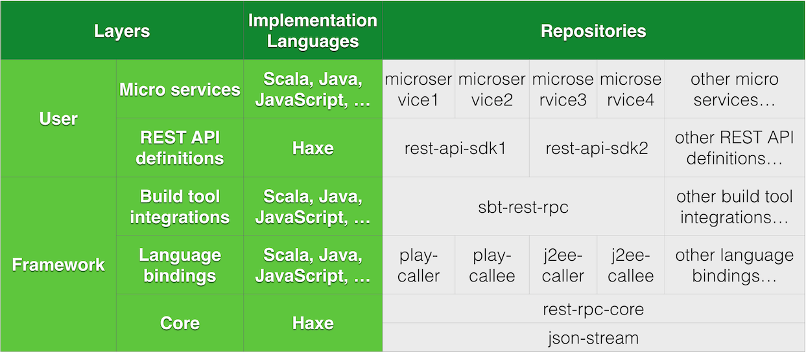

rest-rpc
========

rest-rpc is a framework that allows defining REST API in a RPC-like interface, and generates proxy and stub code for them.

Design
------

Check List
----------

#### For every repository:

-	Must specify name and organization in its build.sbt file.
-	Must declare sbt-haxe plugin in its project/plugins.sbt

#### For `rest-rpc-core`

-	Must contains at least one Haxe source file under src/haxe.
-	Must contains at least one Haxe testing file under src/test-haxe.
-	The testing file must contain test cases for the Haxe source file.

#### For `rest-rpc-play` and `rest-rpc-sample`

-	Must contains at least one Scala source file under src/main/scala.
-	Must contains at least one Scala testing file under src/test/scala.
-	The testing file must contain test cases for the Scala source file.

#### For `rest-rpc-play`

-	The Scala source file must use at least one function in rest-rpc-core.

#### For `rest-rpc-sample`

-	The Scala source file must use at least one function in rest-rpc-play.
-	Must enable sbt settings from the plugin in sbt-rest-rpc.

#### For `sbt-rest-rpc`

-	Must contains an singleton that extends sbt.AutoPlugin.

#### For `rest-rpc`

-	Must contains all other repository as git submodules.
-	Must declare dependencies between these submodules.

Required knowledge
------------------

-	https://git-scm.com/book/en/v2/Git-Tools-Submodules
-	http://www.scala-sbt.org/0.13/tutorial/Multi-Project.html
-	http://www.scala-sbt.org/0.13/docs/Plugins.html
-	http://www.scala-sbt.org/0.13/tutorial/Organizing-Build.html
-	https://github.com/qifun/sbt-haxe
